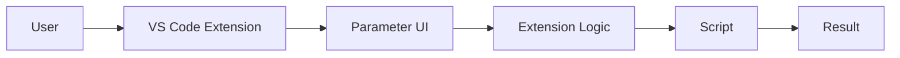
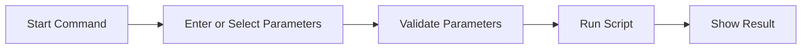

# VS Code Extension Prototype

## 1. Project Goal

This project is my first exploration of VS Code extension development.

The goal is to understand how a VS Code extension works and explore different UI options for users to define parameters before running a script.

Before implementing the final extension, I created several small demos to understand the basic VS Code Extension API.

## 2. Current Demos

### Demo 1 - Hello World Command

A simple command using `registerCommand()`.

This helped me understand how a command defined in `package.json` is connected to the logic in `extension.ts`.

### Demo 2 - Parameter Input

This demo uses `showInputBox()` to collect text input from the user.

For example, the user can enter a parameter such as a name, path, or other value.

### Demo 3 - Parameter Selection

This demo uses `showQuickPick()` to let the user select from predefined options:

- Development
- Testing
- Production

This helped me understand the difference between free text input and predefined parameter selection.

## 3. Proposed Architecture

The current idea is to use the VS Code extension as an interface between the user and the script.

### Explanation

- **User**: starts the command and provides parameters.
- **VS Code Extension**: controls the interaction with the user.
- **Parameter UI**: uses components such as `InputBox` and `QuickPick`.
- **Extension Logic**: collects and checks the parameters.
- **Script**: receives the parameters and performs the task.
- **Result**: shows the output to the user.

The script execution is not implemented yet. This diagram represents the current design idea.

## 4. Proposed User Workflow

The expected workflow is:

The user first starts a command from VS Code. The extension then collects the required parameters using the appropriate UI components.

After the parameters are checked, the extension will pass them to a script. Finally, the result will be displayed in VS Code.

Parameter validation and script execution are not implemented in the current prototype.

## 5. Main Project Files

- `src/extension.ts` - contains the main extension logic.
- `package.json` - defines the extension and its commands.
- `tsconfig.json` - contains the TypeScript compiler configuration.
- `.vscode/` - contains launch and development configurations.

`node_modules/` contains installed dependencies and should not be uploaded to GitHub.

`out/` contains compiled JavaScript and can be generated again from the TypeScript source code.